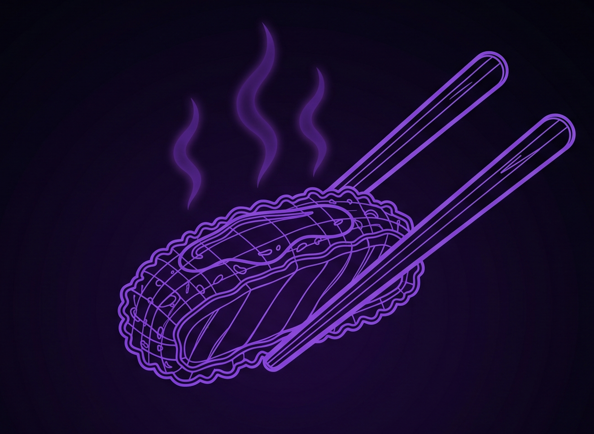

<div align="center">
  
  <h1>Tonkatsu</h1>
  <p><strong>A self-hosted virtual office for AI agents.</strong><br/>Multiple Claude Code agents running autonomously, collaborating in real time, and streaming live to your browser.</p>

  [](LICENSE)
  [](https://github.com/pierredosne-fin/data-platform-tonkatsu/actions)
  [](https://pierredosne-fin.github.io/data-platform-tonkatsu/)
  [](https://nodejs.org)
</div>

---

## What is Tonkatsu?

Tonkatsu is an open-source platform where you build a team of AI agents, give each one a role and a workspace, and watch them collaborate — without babysitting every step.

- **Visual office grid** — agents occupy rooms in a 5×3 grid. See who is running, idle, or waiting for your input at a glance.
- **Real-time streaming** — every token streams live to the browser via Socket.IO. No polling, no refresh.
- **Agent delegation** — agents hand off work to each other automatically, up to 5 levels deep. You talk to the coordinator; it handles the rest.
- **Persistent memory** — agents remember what they've learned across sessions. Conversations survive server restarts.
- **Repo-backed agents** — tie an agent to a git repository. It gets its own branch and worktree, reads and commits code, and keeps identity files private.
- **Cron scheduling** — run agents on a cron expression. Daily reports, monitoring alerts, data syncs — fully automated.
- **Templates** — snapshot any live agent or team configuration and reinstantiate it with one API call.
- **Self-hosted** — your Anthropic API key and data never leave your server.

---

## Quick start

### Prerequisites

- Node.js 20+
- An [Anthropic API key](https://console.anthropic.com)

### Install & run

```bash
git clone https://github.com/pierredosne-fin/data-platform-tonkatsu.git
cd data-platform-tonkatsu
npm install
```

Create `server/.env`:

```env
ANTHROPIC_API_KEY=sk-ant-...
PORT=3001   # optional, defaults to 3001
```

```bash
npm run dev
```

| Service | URL |
|---------|-----|
| App (client) | http://localhost:5173 |
| API (server) | http://localhost:3001 |
| Docs (local) | http://localhost:3000 (`npm run docs:dev`) |

---

## Docker

```bash
docker build -t tonkatsu .
docker run -e ANTHROPIC_API_KEY=sk-ant-... -p 3001:3001 tonkatsu
```

Production images are published to GitHub Container Registry on every release:

```bash
docker pull ghcr.io/pierredosne-fin/data-platform-tonkatsu:latest
```

---

## Tech stack

| Layer | Technology |
|-------|-----------|
| Backend | Express + Socket.IO, ESM TypeScript (`tsx watch`) |
| Frontend | React 19 + Vite, Zustand |
| AI | `@anthropic-ai/claude-agent-sdk` · `claude-sonnet-4-6` |
| Container | Docker (multi-stage) · GitHub Container Registry |
| CI/CD | GitHub Actions · semantic-release |
| Docs | Docusaurus 3 · GitHub Pages |

---

## Project structure

```
.
├── client/               # React 19 + Vite frontend
│   └── src/
├── server/               # Express + Socket.IO backend
│   └── src/
│       └── services/
│           ├── agentService.ts       # Agent lifecycle & persistence
│           ├── claudeService.ts      # Claude SDK execution & delegation
│           ├── persistenceService.ts # Disk state (agents, schedules, templates)
│           └── roomService.ts        # 5×3 room grid management
├── docs/                 # Docusaurus documentation site
├── workspaces/           # Agent workspaces on disk (gitignored)
├── repos/                # Bare git clones for repo-backed agents (gitignored)
├── Dockerfile
└── CLAUDE.md
```

---

## Socket.IO events

Tonkatsu uses Socket.IO for real-time communication. All events are on the default namespace (`/`).

### Connection

On connect the server immediately emits:

| Event | Payload | Description |
|-------|---------|-------------|
| `agent:list` | `ClientAgent[]` | Full agent roster |
| `team:list` | `Team[]` | All teams |

### Standard subscriptions (all connected clients)

| Direction | Event | Payload | Description |
|-----------|-------|---------|-------------|
| C→S | `agent:subscribe` | `{ agentId }` | Join room `agent:{agentId}`; server sends back `agent:history` |
| C→S | `agent:unsubscribe` | `{ agentId }` | Leave room `agent:{agentId}` |
| S→C | `agent:history` | `{ agentId, history }` | Full conversation history (sent to room members) |
| S→C | `agent:list` | `ClientAgent[]` | Broadcast when roster changes |
| S→C | `team:list` | `Team[]` | Broadcast when team structure changes |
| S→C | `agent:created` | `ClientAgent` | New agent spawned |
| S→C | `agent:updated` | `Partial<ClientAgent>` | Agent properties changed |
| S→C | `agent:deleted` | `{ agentId }` | Agent removed |
| S→C | `agent:statusChanged` | `{ agentId, status, pendingQuestion? }` | Status transition |
| S→C | `agent:message` | `{ agentId, message }` | Completed user or assistant message |
| S→C | `agent:delegating` | `{ fromAgentId, toAgentId, toAgentName, message }` | Delegation started |
| S→C | `agent:delegationComplete` | `{ fromAgentId, toAgentId, toAgentName, response }` | Delegation finished |
| S→C | `agent:error` | `{ agentId, error }` | Agent error |
| S→C | `agent:sessions` | `{ agentId, sessions }` | Available session list |
| S→C | `workspace:synced` | `{ agentId }` | Workspace git sync completed |

### Agent control

| Direction | Event | Payload | Description |
|-----------|-------|---------|-------------|
| C→S | `agent:sendMessage` | `{ agentId, message }` | Send a user message to an agent |
| C→S | `agent:sleep` | `{ agentId }` | Abort the current task and set status to sleeping |
| C→S | `agent:newConversation` | `{ agentId }` | Clear conversation history |
| C→S | `team:newConversation` | `{ teamId }` | Clear history for all team agents |
| C→S | `agent:listSessions` | `{ agentId }` | Request available sessions |
| C→S | `agent:resumeSession` | `{ agentId, sessionId }` | Restore a past session |
| C→S | `agent:moveRoom` | `{ agentId, targetRoomId }` | Move agent to a different grid room |

### Zoom — detail-level subscriptions

Detail events (streaming tokens, tool calls, tool results) are **only** delivered to clients that have explicitly zoomed in. Non-zoomed clients never receive these high-frequency events.

**Socket.IO room names:**
- `agent:zoomed:{agentId}` — joined via `agent:zoom-in`
- `room:detail:{roomId}` — joined via `room:zoom-in`

Detail events are sent to **both** rooms so a client can zoom into either an agent or a grid room and receive the same stream.

#### Zoom control events (Client → Server)

| Event | Payload | Description |
|-------|---------|-------------|
| `agent:zoom-in` | `{ agentId: string }` | Subscribe to detail events for an agent |
| `agent:zoom-out` | `{ agentId: string }` | Unsubscribe from detail events for an agent |
| `room:zoom-in` | `{ roomId: string }` | Subscribe to detail events for a grid room |
| `room:zoom-out` | `{ roomId: string }` | Unsubscribe from detail events for a grid room |

#### Detail events (Server → zoomed clients only)

| Event | Payload | Description |
|-------|---------|-------------|
| `agent:stream` | `{ agentId, chunk: string, done: boolean }` | Streaming token chunk. Chunks are batched (≤50 ms) before delivery. `done: true` signals end of stream. |
| `agent:toolCall` | `{ agentId, toolCallId, tool, input }` | Tool invocation initiated by the agent |
| `agent:toolResult` | `{ agentId, toolCallId, tool, result }` | Tool result returned to the agent (truncated to 500 chars) |

#### Memory safety

Socket.IO removes sockets from all rooms on disconnect. Throttle timers are keyed by `agentId` and cleared when the stream ends (`done: true`), so no timers outlive a task.

---

## CI/CD

| Workflow | Trigger | What it does |
|----------|---------|-------------|
| `pr-checks.yml` | PR → `main` | Lint · type-check · build |
| `release.yml` | Push → `main` | Lint · build · Docker push (`dev-<sha>`) |
| `manual-release.yml` | Manual (`workflow_dispatch`) | Semantic release · Docker (`vX.Y.Z` + `latest`) · Docs deploy |
| `docs.yml` | Push → `main` | Build & deploy Docusaurus to GitHub Pages |

Trigger a release manually from **Actions → Manual Release → Run workflow**.

---

## Documentation

Full documentation is available at **[pierredosne-fin.github.io/data-platform-tonkatsu](https://pierredosne-fin.github.io/data-platform-tonkatsu/)**.

To run docs locally:

```bash
cd docs && npm install && npm run start
```

---

## Contributing

1. Fork the repo and create a branch from `main`
2. Make your changes — every PR runs lint, type-check, and build automatically
3. Open a pull request against `main`

Commits follow [Conventional Commits](https://www.conventionalcommits.org/) (`feat:`, `fix:`, `chore:`, etc.) — this drives automatic versioning via semantic-release.

---

## License

Copyright 2024-present the Tonkatsu contributors.

Licensed under the **Apache License, Version 2.0**. See [LICENSE](LICENSE) for the full text.

> You may obtain a copy of the License at http://www.apache.org/licenses/LICENSE-2.0
